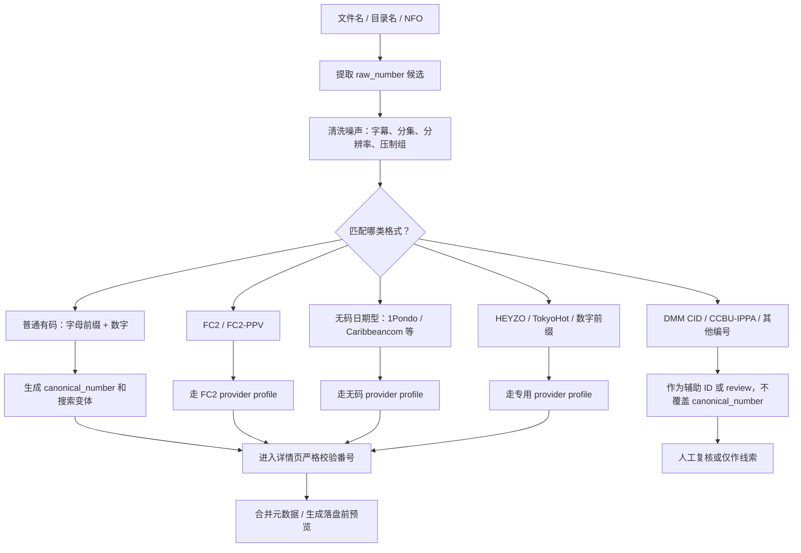
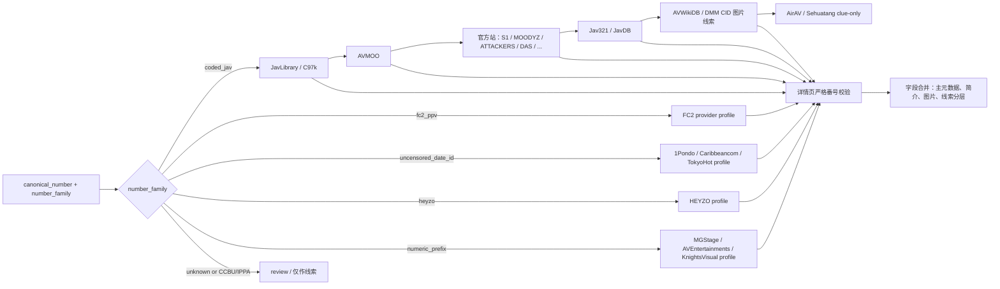
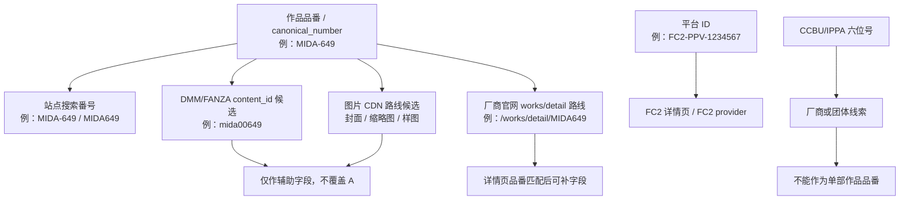
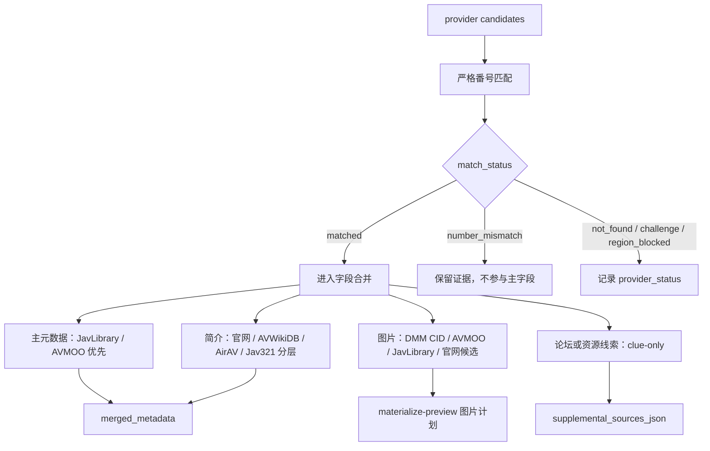

# 日本 AV 番号类型与厂商路由调研

生成时间：2026-06-02

图片资产：

- `assets/jav_number_family_map_20260602.svg`
- `assets/jav_provider_routing_stack_20260602.svg`
- `assets/jav_identifier_relationship_20260602.svg`
- `assets/jav_field_merge_priority_20260602.svg`

## 范围和边界

本文用于 `selfscraper` 后续番号识别、provider 路由和本地刮削数据库设计。本文只总结公开资料、项目内已有研究结论和可落地规则，不代表已修改正式脚本，也不授权移动、删除、重命名或写入 `I:\` 媒体文件。

需要特别保留的不确定性：

- 番号前缀只能作为 `maker_hint` 或 `provider_hint`，不能直接当作最终厂商事实。
- 搜索结果页不能直接认定命中，必须进入详情页后用标准化番号严格校验。
- DMM/FANZA `content_id`、平台内容 ID、CCBU/IPPA 编号和作品品番不是同一种字段，不能互相覆盖。
- 厂商前缀表会变化，也会出现历史迁移、label 复用和公开资料冲突，最终以详情页字段和多 provider 交叉验证为准。

## 核心结论

现有 `identify.py` 里的基础正则适合识别 `MIDA-649`、`ABF-037`、`ADN-620` 这类 `字母前缀 + 数字 + 可选后缀` 的普通有码番号，但不足以覆盖全部日本 AV 来源。后续应把番号识别拆成两层：

1. `number extractor`：从文件名、目录名、NFO 中提取候选字符串。
2. `number classifier`：把候选归类为普通有码、数字前缀、FC2、无码日期型、HEYZO/TokyoHot、DMM CID、CCBU/IPPA 等 family，并决定 provider 路由。

推荐新增字段：

| 字段 | 用途 |
|---|---|
| `raw_number` | 文件名/目录名/NFO 中原样命中的候选 |
| `canonical_number` | 入库和展示用标准番号，例如 `MIDA-649` |
| `search_number` | provider 查询用番号，去掉 `-C`、`-UC`、`-U` 等字幕/修正版后缀 |
| `number_family` | `coded_jav`、`fc2_ppv`、`uncensored_date_id`、`heyzo`、`numeric_prefix` 等 |
| `maker_hint` | 根据前缀推断的厂商提示，低置信 |
| `label_hint` | 根据前缀或详情页推断的 label/series 提示 |
| `suffix_flags` | `subtitle`、`uncensored_leak`、`part`、`disc`、`review` 等标记 |
| `content_id_candidates_json` | DMM/FANZA CID 或图片 CDN 候选，如 `mida00649`、`118abw00001` |
| `provider_profile` | 推荐 provider 顺序，例如 `javlibrary,avmoo,official,jav321` |
| `confidence` | 识别置信度 |
| `review_reason` | 不确定、冲突或需要人工复核的原因 |

## 说明图 1：番号识别总流程




## 番号类型分类

| 类型 | 常见样例 | 识别规则 | 背景 / 题材线索 | 风险 | 推荐处理 |
|---|---|---|---|---|---|
| 普通有码品番 | `MIDA-649`、`ADN-620`、`ABW-001`、`SSIS-123` | `字母前缀 2-10 位 + 数字 2-6 位 + 可选短后缀` | 前缀通常提示 studio、label 或系列线；题材要从 `series`、`genre/tags`、标题和简介判断，常见是剧情向、职业/场景、企划系列、VR、合集等元数据类别 | 前缀不等于最终厂商；公开前缀表可能冲突 | 归一化为 `PREFIX-123`，走 JavLibrary/AVMOO，再走官网兜底 |
| 官方紧凑品番 | `MIDA490`、`ADN620`、`DASS620` | 官网详情页常显示 `DVD MIDA490` 这种无连字符写法 | 与普通有码品番是同一作品体系；官网详情页通常最适合补 `story/outline`、官方标题、官方 genre、label、series | 文件名和站点写法不同 | `canonical_number=MIDA-490`，保留原始 `raw_number=MIDA490` |
| DMM/FANZA CID | `mida00649`、`118abw00001`、`stars00266` | 站点内容 ID，常是 prefix 小写 + 补零数字，或带 maker 数字前缀 | CID 本身不表达题材，但可连接到 DMM/FANZA 的 `iteminfo`，用于补 maker、label、series、genre、演员、图片和样图 | 不是文件名番号，不能覆盖 canonical | 作为 `content_id_candidates_json`，用于图片/CDN/AVWikiDB/DMM 线索 |
| 数字前缀 / MGStage 系 | `200GANA-2998`、`300MAAN-xxxx`、`261ARA-xxxx` | 数字 + 字母厂商段 + 数字 | 数字段更像平台/发行/label 线索；具体背景常由系列名、发行频道、标题和标签给出，不能只靠前缀判断故事类型 | 现有纯字母前缀正则会漏 | 新增 `numeric_prefix` family，优先 MGStage/相关 provider，但当前本机不默认启用 MGStage |
| FC2 / FC2-PPV | `FC2-PPV-1234567`、`FC2-1234567` | `FC2` + 可选 `PPV` + 6-8 位数字 | 更接近平台投稿/PPV 内容 ID；背景信息常由上传者标题、说明、标签和投稿者页面给出，结构化程度低于厂商片 | 与普通有码站点逻辑不同 | 走 `website_fc2`，避免先查 JavLibrary |
| 无码日期型 | `112619_001`、`112619-001` | 日期或日期近似 + 序号，站点可能使用 `_` 或 `-` | 编号常含发布日期或站点序号；题材通常来自站点分类、标题、演员页和系列页，而不是编号本身 | 1Pondo、Caribbeancom 等可能出现相似格式 | 需要来源词、站点 profile 或多 provider 严格匹配 |
| HEYZO / TokyoHot | `HEYZO-2998`、`n1234`、`k1234` | 固定站点前缀或短字母 + 数字 | 前缀主要提示站点品牌；故事或主题仍需从站点详情的 title、genre、outline 和 actor 字段提取 | 与普通有码前缀含义不同 | 走专用 provider，不并入通用厂商前缀表 |
| IPPA / CCBU 编号 | `010054` 等六位数字 | 厂商或团体编号，不是单部作品品番 | 可作为组织/厂商背景线索，不能判断作品故事、题材或单片元数据 | 容易被误当作番号 | 仅作 maker/organization hint 或 review 线索 |
| 中文字幕/泄露/修正版后缀 | `ABF-037-C`、`ABF-037-UC`、`ABF-037-U` | 普通番号后接短后缀 | 后缀多反映文件版本、字幕、流出/修正状态，不是作品题材；题材仍来自去后缀后的主番号详情页 | 后缀可能不是官方品番一部分 | `search_number=ABF-037`，`suffix_flags` 记录后缀 |

## 内容背景与题材字段

番号本身主要是发行和索引用 ID，不应被当作剧情或主题分类。对 `selfscraper` 来说，题材和故事背景应从以下字段分层读取：

| 字段 | 可信用途 | 注意事项 |
|---|---|---|
| `series` | 系列企划、长期栏目、固定叙事模板 | 比 prefix 更接近作品定位，但仍需和详情页番号匹配 |
| `label` | 厂牌内的产品线或风格线索 | label 可迁移或复用，不能单独决定题材 |
| `genre/tags` | 场景、角色关系、拍摄形式、服装/职业、合集、VR 等主题标签 | 不同站点标签粒度不同，需要归一化 |
| `title` | 最直接的主题线索 | 标题可能夸张、含广告词，需要清洗 |
| `outline/plot/story` | 具体故事背景、设定和简介 | 来源语言要标注；中文简介不能当作日文原文 |
| `director` | 对剧情结构或拍摄风格可能有辅助价值 | 不是所有站点都有稳定导演字段 |
| `runtime` / `actor_count` | 区分单体、合集、多演员、长篇/短篇的辅助线索 | 不能替代 NFO actor 数量和详情页字段 |
| `provider_role` | 区分主元数据、简介补充、图片线索、clue-only | 防止论坛或低质量站覆盖主字段 |

建议在合并元数据时增加一个独立字段组：

```text
theme_tags_json
theme_source_json
story_source
story_language
story_confidence
series_context
label_context
content_form
```

其中 `content_form` 可使用保守的元数据分类，例如：

| `content_form` | 判定线索 | 用途 |
|---|---|---|
| `single_release` | 单番号、单主视频、actor 数量较少 | 普通单片 |
| `omnibus_or_compilation` | 标题/标签含合集、总集、best、多个片段；时长异常长 | 目录和 NFO 复核 |
| `vr` | prefix、title、tags 或站点分类含 VR | 图片和标题展示可标记 VR |
| `amateur_or_creator_marketplace` | `fc2_ppv`、部分数字前缀、上传者/投稿者页面 | provider 顺序和字段置信度降低 |
| `official_series_episode` | series 字段稳定，官网可验证 | 适合建立系列索引 |
| `uncensored_site_release` | 无码日期型、HEYZO/TokyoHot 等专用站点 | 走专用 provider 和站点标签 |

各类番号的背景补充：

- `coded_jav`：最适合建立 `maker -> label -> series -> genre` 四层背景。厂商只说明发行体系，`series` 和 `genre/tags` 才更接近主题；例如是否是固定企划、剧情设定、VR、合集、多演员等，应从详情页字段提取。
- `official_compact`：与 `coded_jav` 共用背景模型，但官网详情页通常更适合抽取官方简介、官方标签和系列上下文。若官网与聚合站冲突，官网字段可作为高置信补充，但仍要验证品番。
- `dmm_fanza_cid`：主要是平台索引背景，可帮助拿到 DMM/FANZA 的 maker、label、series、genre 和图片；它不代表作品故事，不能因为 CID 命中就覆盖主番号。
- `numeric_prefix`：通常需要依赖发行平台或频道字段理解背景。数字前缀本身更像站点/发行线索，故事和主题要从 title、series、label、tags 提取。
- `fc2_ppv`：平台投稿属性更强，背景常来自上传者标题、说明和标签，结构化质量不稳定。应降低自动题材置信度，并保留 `creator_marketplace` 标记。
- `uncensored_date_id`：日期型编号可帮助识别站点和发布日期，但主题主要来自站点分类、标题和演员页。不同站点相似编号不能混查后直接合并。
- `heyzo/tokyohot`：站点品牌就是强 provider hint，但不是题材。应从专用站点详情页读取 story、genre、actor、series。
- `ccbu_ippa_or_unknown_numeric`：这类编号只能作为组织或资料背景，不提供单片题材。遇到纯数字文件名时默认 review，避免误刮削。
- `suffix_variant`：后缀只标记文件版本，例如字幕、修正或流出状态；不得把后缀当作题材标签，也不得让后缀影响主作品匹配。

## 厂商与前缀样例

这些前缀只用于路由提示。实现时不要把下面的映射当作唯一事实；同一前缀在不同资料中可能被错误归类，或因厂牌迁移产生歧义。

| 厂商 / label | 常见前缀样例 | 当前建议 |
|---|---|---|
| S1 NO.1 STYLE | `SSIS`、`SSNI`、`SNIS`、`SONE`、`SNOS`、`SIVR` | 可路由到 `s1s1s1.com`，但需详情页 `品番` 校验 |
| MOODYZ | `MIDA`、`MIDV`、`MIDE`、`MIAA`、`MIAB` | 当前项目已验证 `MIDA` 可走 MOODYZ 官网补简介 |
| IdeaPocket | `IPX`、`IPZ`、`IPZZ`、`IPVR` | 可加入官网路由候选 |
| Prestige | `ABP`、`ABW`、`ABF`、`START`、`PRED`、`ABS` | 旧作可生成 `118{prefix}{num:05d}` CID 候选；Prestige API 当前不默认启用 |
| ATTACKERS | `ADN`、`ATID`、`SHKD`、`RBD` | `ADN` 应优先路由 ATTACKERS 官网；不要按公开表误归 Prestige |
| DAS | `DASS`、`DASD` | 可路由到 `dasdas.jp` |
| Madonna | `JUL`、`JUQ`、`JUY`、`JUX`、`MEYD` | 走通用主源，官网路由后续再补 |
| SOD / FALENO / kawaii 等 | `STARS`、`SDMU`、`SDDE`、`FSDSS`、`CAWD` | 当前 SOD 受访问限制，不进默认官网 provider；仍可作为 maker hint |

## 说明图 2：provider 路由分层




## 说明图 3：番号、CID 和平台 ID 的关系




## 识别规则建议

### 普通有码

输入：

```text
[中文字幕] MIDA649 1080p.mp4
2024-01-01-MIDA-649-title
ADN620.mkv
ABF-037-UC.mp4
```

输出策略：

| 输入 | `canonical_number` | `search_number` | `suffix_flags` |
|---|---|---|---|
| `MIDA649` | `MIDA-649` | `MIDA-649` | `[]` |
| `ADN620` | `ADN-620` | `ADN-620` | `[]` |
| `ABF-037-UC` | `ABF-037-UC` 或 `ABF-037` + flags | `ABF-037` | `["uncensored_or_leak_suffix"]` |

后续推荐采用第二种保存方式：展示层可显示原始后缀，但 provider 搜索统一使用去后缀的 `search_number`。

### DMM/FANZA CID 候选

CID 不应由单一硬编码规则决定，但可以生成候选用于探针：

| 普通番号 | CID 候选例 | 说明 |
|---|---|---|
| `MIDA-649` | `mida00649` | prefix 小写 + 补零数字 |
| `ABW-001` | `118abw00001` | Prestige 旧作可能出现数字 maker 前缀 |
| `ABF-001` | `118abf00001` | 当前项目已有图片路线探针证据，但不能当完整元数据源 |

候选命中后仍要回填 `matched_number`、`source_url`、`status_code`、`field_payload_json`，并标注它只是辅助 ID。

### 无码和平台型

无码/平台型需要更保守：

- `FC2-PPV-1234567`：直接标记 `number_family=fc2_ppv`。
- `112619_001`：标记 `number_family=uncensored_date_id`，但不要只凭格式判断具体站点。
- `HEYZO-2998`：标记 `number_family=heyzo`。
- 纯六位数字：若像 `010054`，优先标记 `possible_ccbu_ippa_or_unknown_numeric`，不要当作品番号。

## 说明图 4：字段合并原则




## provider 定位建议

| 层级 | provider | 定位 | 注意事项 |
|---|---|---|---|
| 主元数据 | JavLibrary 镜像 / C97k | 番号、标题、演员、日期、厂牌/系列/标签、封面线索 | 需要可见浏览器等待；搜索结果仍需详情页校验 |
| 主/辅元数据 | AVMOO | 标题、日期、时长、导演、maker、label、演员、标签、封面、样图 | 通常不提供可靠简介 |
| 官方补充 | MOODYZ、S1、ATTACKERS、DAS 等 | 日文标题、简介、品番、发行日期、label | 按前缀路由，但以详情页 `品番` 为准 |
| 低优先级兜底 | Jav321 | 部分简介、日期、时长、maker/label | 页面 UI 噪声多，必须清洗 |
| 辅助验证 | JavDB | 标题、番号、评分/标签线索 | 搜索结果误匹配风险高 |
| FANZA/DMM 补充 | AVWikiDB / DMM CID | `summary`、content id、图片 URL、演员/标签交叉验证 | 不替代主元数据源 |
| 中文简介备选 | AirAV | 繁体/简体简介、标题、演员、标签 | 只能标记为中文来源，不可当日文原文 |
| clue-only | Sehuatang 等论坛 | 资源/字幕/磁力线索 | 不进入主元数据字段 |

## 实现落点

建议先作为研究阶段代码实现，不直接固化到正式工具链：

```text
research/selfscraper_mvp/src/selfscraper/number_classifier.py
research/selfscraper_mvp/src/selfscraper/number_classifier_tests.py
research/selfscraper_mvp/reports/<测试报告>.md
results/selfscraper_mvp/manifests/<测试输出>.csv
```

可分三步：

1. 只实现 `classify_number(text)` 和小样本单元测试，不接真实媒体盘。
2. 把 `identify.py` 输出从 `number_guess` 扩展为 `raw_number/canonical_number/search_number/number_family/provider_profile`。
3. 在 `scrape-queue` 和 `browser-scrape` 中按 `provider_profile` 调整 provider 顺序，并保留严格详情页校验。

## 推荐测试样本

| 样本 | 期望 family | 期望 canonical | 备注 |
|---|---|---|---|
| `MIDA649.mp4` | `coded_jav` | `MIDA-649` | 官网可能用 `MIDA649` |
| `ADN620.mkv` | `coded_jav` | `ADN-620` | ATTACKERS 示例 |
| `ABF-037-UC.mp4` | `coded_jav` | `ABF-037` + suffix flag | 搜索时去后缀 |
| `FC2-PPV-1234567.mp4` | `fc2_ppv` | `FC2-PPV-1234567` | 走 FC2 profile |
| `112619_001.mp4` | `uncensored_date_id` | `112619_001` | 具体站点需 provider 验证 |
| `HEYZO-2998.mp4` | `heyzo` | `HEYZO-2998` | 专用站点 |
| `200GANA-2998.mp4` | `numeric_prefix` | `200GANA-2998` | 现有正则会漏 |
| `010054.txt` | `unknown_numeric_or_ccbu_ippa` | 空或 `review` | 不作为作品番号 |

## 参考资料

- Suki Desu：JAV code 的基础结构和前缀解释，https://skdesu.com/en/jav-codes-list/
- GetAV：常见 JAV 前缀列表，https://getav.net/en/codes
- MOODYZ 官方详情页示例，`MIDA490` 品番路线，https://moodyz.com/works/detail/MIDA490
- ATTACKERS 官方详情页示例，`ADN620` 品番路线，https://attackers.net/works/detail/ADN620
- Javinizer 文档：文件匹配和 scraper provider 思路，https://javinizer.gitbook.io/docs/using-javinizer/file-matching
- Javinizer 文档首页，https://javinizer.gitbook.io/docs
- Javinizer Go scraper 列表参考，https://sveltethemes.dev/javinizer/javinizer-go
- CCBU/IPPA 编号说明，https://ccbu-search.com/ccbu-ippa-number/
- CCBU 官方网站，https://ccbu.or.jp/index.html
- 项目内研究：`research/selfscraper_mvp/reports/provider_status_summary_20260602.md`
- 项目内研究：`research/selfscraper_mvp/reports/supplemental_provider_opendmm_avwikidb_20260602.md`
