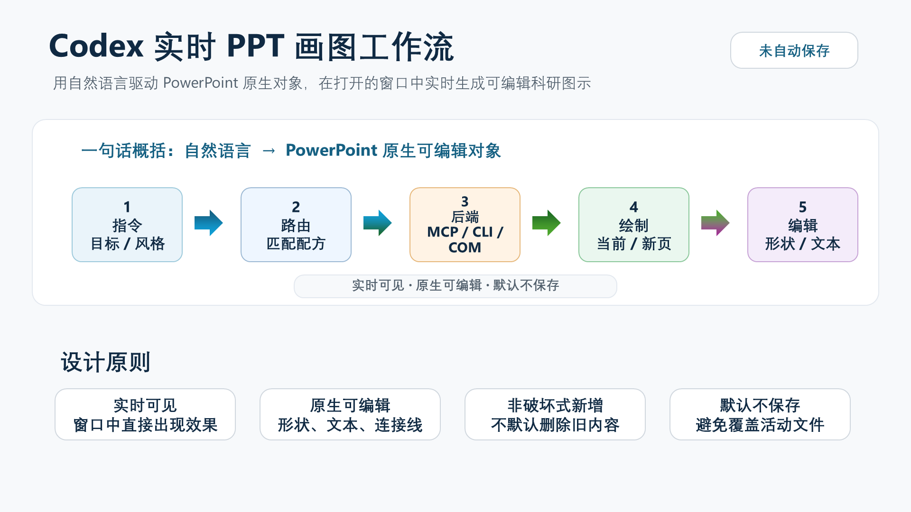
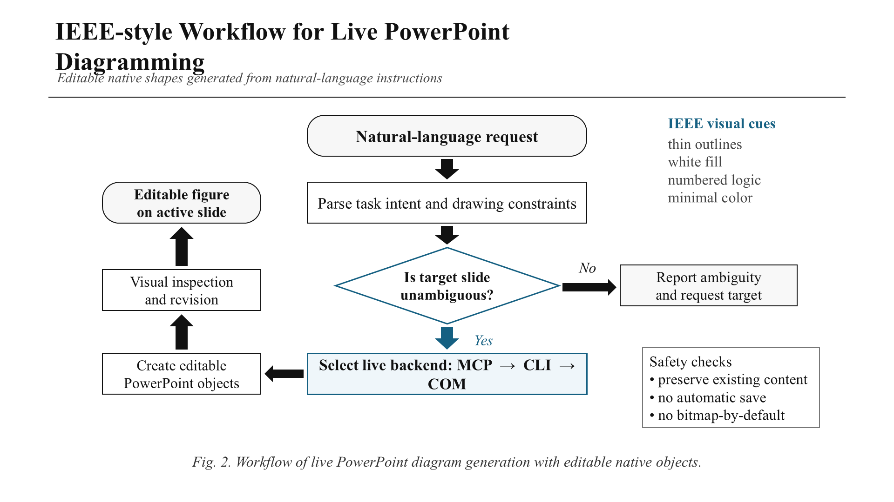
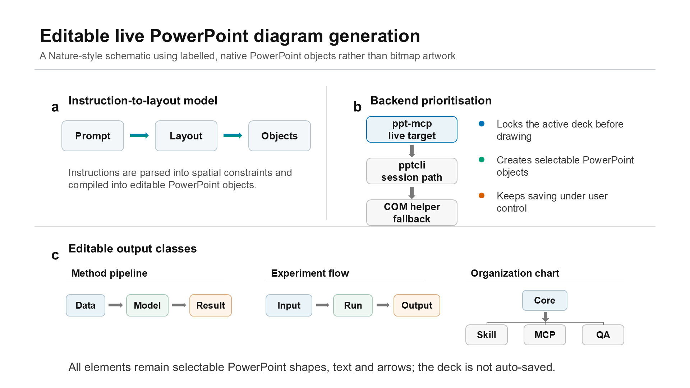

# PPT 自动化绘图与保存流程总结

生成时间：2026-05-30  
成果目录：`results/presentations/2026-05-30_2208_ppt_drawing_feature_intro/`

## 1. 任务目标

本次任务是在当前项目中验证一套可复用的 PPT 自动化绘图流程：由 Codex 实时控制 Windows 本机 PowerPoint，在打开的演示文稿中绘制可编辑流程图，并按项目目录规则保存 PPTX 和导出预览图片。

最终生成了一个 3 页演示文稿，用于介绍“PPT 画图功能”本身：

- 第 1 页：Codex 实时 PPT 画图工作流，采用偏 Nature 风格的渐变箭头和模块流程。
- 第 2 页：IEEE 风格流程图，白底、细线、Times New Roman、低饱和蓝色强调。
- 第 3 页：Nature 风格多面板示意图，白底、panel 字母、细分隔线、克制配色和完整标签。

## 2. 项目入口与规则恢复

开始前按项目入口要求读取并遵守了以下文件：

- `AGENTS.md`
- `skills/PROJECT_SKILLS_GUIDE.md`
- `START_HERE.md`
- `PROJECT_STRUCTURE.md`
- `docs/TOOL_MEMORY_本机工作流.md`
- 项目本地 `live-powerpoint-diagram` skill

关键规则包括：

- 稳定脚本进入 `src/`，验证和研究进入 `research/`。
- PPTX、导出图和渲染检查成果进入 `results/presentations/`。
- 临时脚本和缓存进入 `tmp/`。
- 不默认保存用户打开的 PowerPoint；只有用户明确要求保存时才写入文件。
- PPT 绘图优先使用 PowerPoint 原生可编辑对象，不把整张图转成位图。

## 3. 自动化后端选择

本项目使用项目本地 `live-powerpoint-diagram` skill 作为路由依据。后端优先级为：

1. `ppt-mcp`：优先用于实时控制当前 PowerPoint。
2. `pptcli`：作为会话级备选路径。
3. Windows PowerPoint COM：用于最小 fallback 或导出场景。

本次实际使用：

- 绘图与保存：`ppt-mcp`
- 幻灯片 PNG 导出：PowerPoint COM

使用 `ppt-mcp` 时先锁定目标演示文稿，避免误改其他打开的 PowerPoint 文件。当前演示文稿最初是未保存的 `演示文稿1`，后来保存为正式 PPTX。

## 4. 绘图实现过程

### 4.1 第 1 页：实时绘图工作流

第 1 页用于说明 Codex 如何把用户指令转化为 PowerPoint 中的可编辑图形。主要对象包括：

- 用户指令
- 技能路由
- 后端选择
- PowerPoint 原生对象
- 预览检查与迭代修正

用户反馈右侧模块拥挤、越出白色背景后，对布局进行了两轮修正：

- 调整主流程模块宽度和间距。
- 收紧右侧模块位置，保证所有元素留在白色背景范围内。
- 保持模块间箭头为 Nature 风格渐变色。

预览图如下：



### 4.2 第 2 页：IEEE 风格流程图

第 2 页按 IEEE 风格绘制：

- 白色背景
- Times New Roman 字体
- 细边框和简洁线条
- 少量蓝色强调
- 避免装饰性渐变和卡片化视觉

该页用于展示同一套自动化能力可以切换到更正式、工程论文风格的流程图表达。

预览图如下：



### 4.3 第 3 页：Nature 风格多面板图

第 3 页最初版本存在两个问题：

- 部分方框为空，只像占位符。
- 视觉上更像普通 PPT 卡片，而不是 Nature 风格论文图。

后续按 Nature/高影响力期刊图件习惯重做：

- 使用白底和细分隔线，而不是大面积卡片。
- 使用 `a / b / c` panel 字母。
- 所有节点都有明确标签，不保留空框。
- 使用克制的 Okabe-Ito 倾向配色：蓝、绿、橙、灰黑。
- 将长说明放在节点外，节点内部只保留短标签，避免文字挤压。
- 将 panel 分别分组，便于在 PowerPoint 中整体移动或拆开编辑。

第 3 页最终包含三个 panel：

- `a`：Instruction-to-layout model
- `b`：Backend prioritisation
- `c`：Editable output classes

分组名称：

- `nature_panel_a_prompt_layout_objects`
- `nature_panel_b_backend_priority`
- `nature_panel_c_editable_outputs`

预览图如下：



## 5. 保存流程

用户确认后，将当前打开的演示文稿保存到项目结果目录：

```text
results/presentations/2026-05-30_2208_ppt_drawing_feature_intro/pptx/ppt_drawing_feature_intro.pptx
```

保存后做了两项验证：

- PowerPoint 返回 `saved=true`。
- 文件存在且大小为 `62327` bytes。

PPTX 文件路径：

```text
E:\Work\8、Codex\PPT画图工程\results\presentations\2026-05-30_2208_ppt_drawing_feature_intro\pptx\ppt_drawing_feature_intro.pptx
```

## 6. 图片导出流程

为给 Markdown 文档配图，从已保存 PPTX 导出了 3 张 1920 x 1080 PNG 图片。

导出目录：

```text
results/presentations/2026-05-30_2208_ppt_drawing_feature_intro/figures/
```

图片文件：

```text
slide_01_live_workflow.png
slide_02_ieee_flow.png
slide_03_nature_schematic.png
```

导出时，沙箱内直接创建 PowerPoint COM 对象失败，错误为 `0x80070520`，说明当前沙箱登录会话无法启动 Office COM。随后在用户授权的沙箱外 PowerShell 中执行导出，成功从 PPTX 导出 3 张图片。

## 7. 本次验证出的可复用流程

这套 PPT 自动化流程可以整理为以下固定步骤：

1. 读取项目入口文档和本地 skill 路由。
2. 根据任务选择 `live-powerpoint-diagram`。
3. 用 `ppt-mcp` 连接 PowerPoint，并锁定目标演示文稿。
4. 按用户指定风格创建或修改幻灯片。
5. 每页完成后用 slide preview 进行视觉检查。
6. 根据用户反馈迭代布局、文字、间距和风格。
7. 用户明确要求保存后，再写入 `results/presentations/<run>/pptx/`。
8. 如需文档配图，从保存后的 PPTX 导出 PNG 到 `figures/`。
9. 将流程、文件路径、设计原则和图片整理为 Markdown 文档。

## 8. 后续可固化的改进点

后续可以把这次流程进一步固化为项目内脚本或 skill recipe：

- 增加一键导出 PPTX 为 PNG 的项目脚本。
- 增加 Nature、IEEE、普通答辩风格的预设布局模板。
- 增加保存前检查：是否有空文本框、是否有元素越界、是否存在明显拥挤。
- 增加 Markdown 报告自动生成模板，自动引用导出的幻灯片图片。

本次结果证明：Codex 可以在 Windows 本机 PowerPoint 中完成实时、可编辑、可预览、可保存、可导出图片并可文档化的完整 PPT 自动化闭环。
